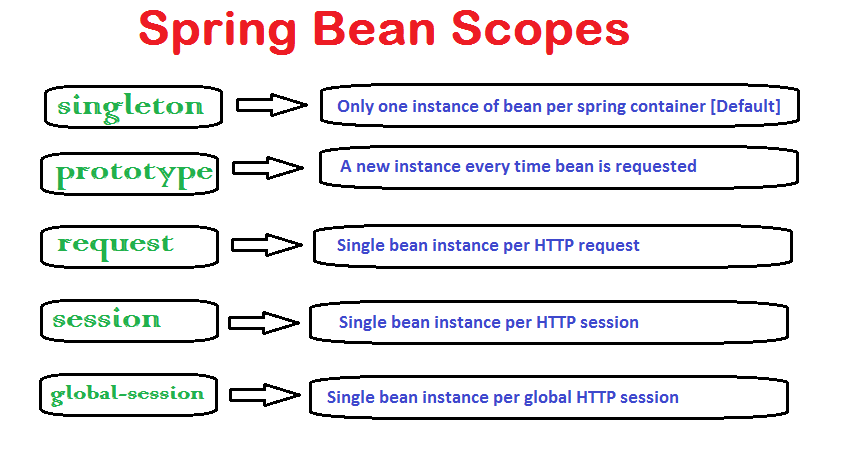

# Spring bean scopes

> The Spring container can be created in five scopes. _Singleton_, _Prototype_, _Request_, _Session_, and _Global-session_.<br>
> 

- _singleton_: This bean scope is default and it enforces the container to have only one instance per spring container irrespective of how much time you request for its instance. This singleton behavior is maintained by bean factory itself.

- _prototype_: This bean scope just reverses the behavior of singleton scope and produces a new instance each and every time a bean is requested.

Remaining three bean scopes are web applications related. Essentially these are available through web aware application context (e.g. WebApplicationContext). Global-session is a little different in sense that it is used when application is portlet based. In portlets, there will be many applications inside a big application and a bean with scope of 'global-session' will have only one instance for a global user session.

- _request_: With this bean scope, a new bean instance will be created for each web request made by client. As soon as request completes, bean will be out of scope and garbage collected.

- _session_: Just like request scope, this ensures one instance of bean per user session. As soon as user ends its session, bean is out of scope.

- _global-session_: global-session is something which is connected to Portlet applications. When your application works in Portlet container it is built of some amount of portlets. Each portlet has its own session, but if your want to store variables global for all portlets in your application than you should store them in global-session. This scope doesn't have any special effect different from session scope in Servlet based applications.

## Define the bean scope

```
<beans xmlns="http://www.springframework.org/schema/beans"
    xmlns:xsi="http://www.w3.org/2001/XMLSchema-instance"
    xsi:schemaLocation="http://www.springframework.org/schema/beans     http://www.springframework.org/schema/beans/spring-beans-2.5.xsd">
       <bean id="demoBean" class="com.howtodoinjava.application.web.DemoBean" scope="session" />
</beans>
```

# Spring bean life cycle call back methods

> Spring framework provides following 4 ways for controlling life cycle events of bean:

> - InitializingBean and DisposableBean callback interfaces
> - Other Aware interfaces for specific behavior
> - custom init() and destroy() methods in bean configuration file
> - @PostConstruct and @PreDestroy annotations notations


